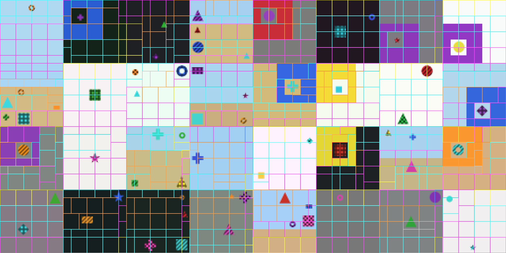
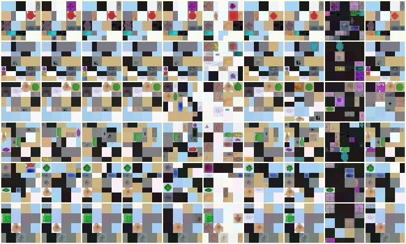
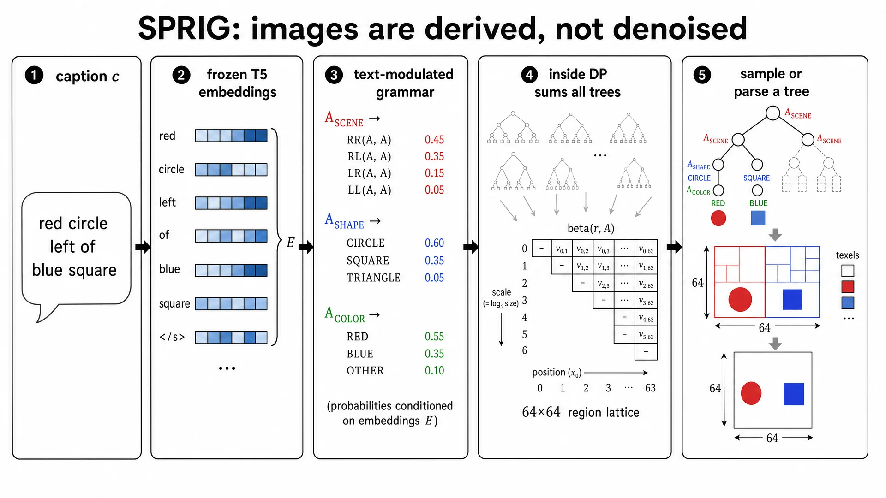

# SPRIG v0.1: a text-to-image model where images are *derived*, not denoised

**Research preview.** SPRIG (Stochastic Production-Rule Image Grammar) is a
**text-conditioned neural probabilistic context-free grammar (PCFG) over a 2D
region lattice**, trained by exact marginal likelihood. A caption modulates the
production probabilities of a learned probabilistic scene grammar, and an image
is produced by a single top-down **derivation** that recursively splits the
canvas into typed regions, each painted by a learned "texel" material. There is
no noise process, no adversary, no ELBO, and no token ordering.

To our knowledge this is the first neural PCFG trained end-to-end for
text-to-image generation. The ingredients have clear ancestry, though, and this
card names it (see [Lineage & related work](#lineage--related-work)): the
training machinery is the classic inside algorithm from grammar parsing, the
rule factorization is adapted from tensorized neural PCFGs, and the
finite-lattice construction is formally a sum-product network. SPRIG's
contribution is the synthesis. These pieces are assembled, text-conditioned,
into a generative image model, with an honest pre-registered evaluation of how
far that gets. The short version: **exact likelihood and parsing work well;
caption-to-object binding does not yet.**

The current release is **v0.1 at 64×64**: a proof-of-concept for the mechanism,
with ~16M trainable parameters on top of a frozen T5-base caption encoder.
Code: [github.com/cebeuq/sprig](https://github.com/cebeuq/sprig).

## The capability that works: parsing

Analysis and synthesis are the *same* grammar run in two directions, so SPRIG
can **parse** a real image. The same dynamic program that computes the training
likelihood (a sum over trees) returns, with max in place of sum, the most
likely derivation of any image: which cuts, which symbols, which materials, as
an inspectable tree.

<p align="center"></p>

Visible-cut parse F1 is **0.77** against ground-truth scene structure on
held-out scenes. Diffusion and AR models have no equivalent of this. SPRIG's
posterior over structure is exactly computable, so every generated or real
image comes with a symbolic explanation of *why* each region is what it is.
Generation itself is much more limited at v0.1; see [Results](#results).

<p align="center"></p>

## What SPRIG does differently

| | Diffusion / Flow | Autoregressive | **SPRIG** |
|---|---|---|---|
| Generative act | denoise a fixed grid over many steps | predict tokens in an order | **derive a tree**: recursively split the canvas, commit each node once |
| Latent | noisy image | token prefix | an *unobserved random tree* summed out |
| Training | denoising / score matching | next-token likelihood | **exact marginal likelihood** via inside DP |
| Free bonus | — | — | a real **likelihood** + an interpretable **parse** of any image |

## Method

<p align="center"></p>

SPRIG is a **text-modulated probabilistic scene grammar** `G_c = (Σ, N, A₀, Π_c)`
with nonterminal symbols `N`, texels (learned material primitives) `Σ`, an
axiom `A₀`, and caption-conditioned productions `Π_c`. An image is one
**derivation** `τ`: a binary tree that recursively splits the 64×64 canvas (a
finite 1296-region binary-space-partition lattice, leaves ≤16px) and paints
each leaf region with a texel. The conditional density marginalizes over *all*
derivation trees:

$$
p(x \mid c) = \sum_{\tau} \; \prod_{\text{splits}} \pi\big(A \to \langle s,B,C\rangle \mid c\big) \; \prod_{\text{leaves}} \pi(T \mid A, c)\, p_{\mathrm{emit}}(x_r \mid T, r, c)
$$

Text enters through a low-rank factorization of the rule probabilities:

$$
\pi\big(A \to \langle s,B,C\rangle \mid c\big) = \sum_{k=1}^{R} p(k \mid A, c)\; p(s \mid k, c)\; p(B \mid k)\; p(C \mid k)
$$

The only caption-dependent factor, the mixture `p(k | A, c)`, is produced by a
**Grammar-Modulation Transformer** whose queries are the symbol embeddings and
which cross-attends to the frozen T5-base caption. *Text deforms the grammar;
it does not steer a sampler.* Each leaf emits a 4-component discretized-logistic
mixture over its pixels.

Because the lattice and the cut dictionary are finite, the marginal is computed
**exactly** by a log-semiring inside dynamic program over regions, and the
training loss is the exact negative log-likelihood

$$
\mathcal{L} = -\beta(A_0, \text{canvas})
$$

with no encoder, no ELBO, and no sampling in the loop. The *same* DP with a
max-semiring yields the **Viterbi parse** of any image, which is why analysis
and synthesis are the same object.

| S | T_v | R | d | canvas / grid | lattice | encoder | params |
|---|---|---|---|---|---|---|---|
| 1024 | 256 | 64 | 384 | 64² / 8px | 1296 regions | T5-base (frozen) | ~15.9M |

## Lineage & related work

SPRIG should be judged against its actual neighbors, not presented as
parentless. The relevant lines of work:

- **Stochastic image grammars.** Zhu & Mumford, *A Stochastic Grammar of
  Images* (2006). The conceptual grandparent: scene grammars with and-or
  graphs, but hand-designed rules, MCMC parsing, no end-to-end likelihood
  training, and no text conditioning. SPRIG learns the grammar from data by
  exact maximum likelihood and conditions it on captions.
- **Sum-product networks / probabilistic circuits.** Poon & Domingos,
  *Sum-Product Networks* (2011). Any finite split dictionary on a finite
  region lattice with an exact inside pass compiles to a decomposable
  sum-product circuit, and the Poon–Domingos architecture used essentially
  this region decomposition. **v0.1's finite-lattice model is formally a
  member of this family.** What it adds within the family: a text-modulated
  low-rank rule tensor, learned texel emissions with an illumination field,
  and the training/health recipe reported here.
- **Neural, compound, and tensorized PCFGs.** Kim et al., *Compound
  Probabilistic Context-Free Grammars* (2019); Yang et al., *PCFGs Can Do
  Better* (TN-PCFG, 2021). The rank-space rule factorization and the
  GPU-friendly inside pass are adapted directly from this NLP toolbox, moved
  from 1D span lattices over strings to a 2D region lattice over pixels, with
  caption conditioning replacing the sentence.

So the honest claim is not "a new paradigm with no ancestors." It is a
**synthesis** (text-conditioned neural PCFG, BSP region lattice, learned
emissions, trained by exact NLL for image generation) that, as far as we know,
had not been built and evaluated before, together with evidence about which
parts of it work.

## Results

Success criteria were fixed in advance (50k steps, held-out procedural scenes):

| Gate | Target | Result | |
|---|---|---|---|
| Likelihood vs. no-grammar baseline | beat by ≥0.15 bpd | **2.66 vs 6.28 bpd** | ✅ crushes it |
| Caption information gain Δc | ≥ 0.05 | **0.248** | ✅ 5× |
| Visible-cut parse F1 | ≥ 0.6 | **0.765** | ✅ parsing works |
| Object-cell parse recall (tier1/2) | ≥ 0.70 / 0.50 | 0.20 / 0.22 | ❌ scenes too busy |
| Prompt-swap attribute control | ≥ 0.80 | 0.37 | ❌ partial |
| — size attribute specifically | — | **1.00** | ✅ size binds perfectly |
| Spatial-relation accuracy | ≥ 0.70 | 0.00 | ❌ |
| Compositional holdout (unseen combos) | ≥ 0.60 | 0.01 | ❌ |
| Grammar health (S_eff / alive texels) | ≥256 / ≥50% | 968 / 43% | ⚠️ texels over-pruned |

The architecture's structural claims prove out: it models data far better than
a no-grammar baseline, routes caption information, recovers scene structure by
parsing, and (after a targeted fix) paints real objects. The open problem is
**caption-to-object binding**. The model can draw objects, and it binds size
perfectly, which proves the conditioning pathway is capable of binding an
attribute. But it does not yet reliably paint the *specific* object a prompt
asks for, and it places too many objects per scene. The v0.1 rule tables that
pick children and texels are deliberately text-independent (a GPU-economy
choice); routing caption signal into them is the next experiment.

## Compute: why an exact-likelihood model trains slowly

Fair question, so here is the arithmetic. Every training step computes the
exact marginal likelihood of each image: the inside DP sums over **every
derivation tree**, meaning all 1,296 lattice regions × every legal cut × 1,024
symbols × 64 rank components, and it scores every leaf-eligible region against
all 256 texels. The per-image cost is orders of magnitude more than a forward
pass through a similarly-sized UNet or transformer, so a 16M-parameter model
here costs what a much larger conventional model would. After kernel fusion
and a sync-free DP sweep (a 6.9× speedup over the naive implementation),
throughput is ~98 images/s on one RTX PRO 6000 Blackwell; the v0.1 runs were
80k + 50k steps at batch 256, roughly **4 GPU-days total**. This is a property
of the objective, since exact likelihood means a full dynamic program per
example. Making it scale to higher resolution is the central open engineering
problem of this architecture, not an implementation accident.

## Usage

```bash
pip install torch safetensors transformers pillow
# get the `sprig` package + this file from the code repo, then:
python inference.py --prompt "a red circle on a white background" --out out.png
```

```python
from inference import load_sprig, sample
model = load_sprig("sprig-v0.1.safetensors", "config.json")   # ~16M params, CPU-friendly
img = sample(model, "a green triangle", seed=0)               # PIL.Image, 64x64
```

The model outputs native **64×64** images (upscale with nearest-neighbor to
view). It also returns the derivation tree, so you can inspect *why* each
region was drawn.

## Files

- `sprig-v0.1.safetensors`: EMA-merged inference weights (60.8 MB, fp32, 15.9M params)
- `config.json`: architecture config + release metadata
- `inference.py`: minimal load + sample + T5 caption encoding
- `metrics.json`: full evaluation numbers
- `figures/pipeline.png`: the method schematic
- `samples.jpg`, `texel_atlas.png`, `parses.png`: qualitative outputs
- `DESIGN.md`: the concrete v0.1 architecture specification

## Training

64×64, 2M procedural compositional scenes (colored shapes with attributes and
spatial relations, templated dense captions, held-out attribute combinations),
frozen T5-base captions precomputed. Exact-likelihood objective plus
closed-form grammar-health regularizers. One RTX PRO 6000 Blackwell GPU, ~50k
steps. Generator: see the companion dataset repo (seeded, deterministic).

## Limitations & intended use

Research artifact for studying grammar-based generation and exact-likelihood
text-to-image. **Not** a production image generator: 64×64, synthetic domain,
object binding incomplete. Samples are blocky by construction (axis-aligned
region splits). MIT licensed. Build on it.

## Citation

```bibtex
@software{sprig_v0_1_2026,
  title  = {SPRIG: Text-to-Image by a Stochastic Production-Rule Image Grammar (v0.1)},
  year   = {2026},
  note   = {Research preview. A text-conditioned neural PCFG over a 2D region
            lattice, trained by exact marginal likelihood; images are derived,
            not denoised.}
}
```
